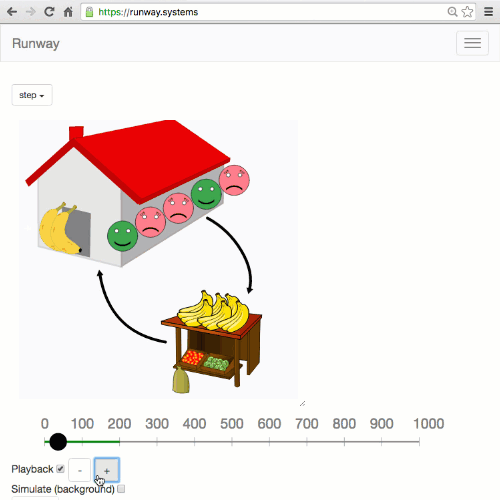

# Runway Web Interface

This provides a web interface to Runway, so you can run models of distributed
systems, visualize them, and interact with them. It embeds
[runway-compiler](https://github.com/salesforce/runway-compiler) to parse
and execute model files.

Runway is a newly released project (May 2016), and we're actively working on
introductory materials and documentation. Existing resources include:
 - [intro blog post](https://medium.com/salesforce-open-source/runway-intro-dc0d9578e248),
   includes recording of talk and demos of Too Many Bananas, Elevators, Raft models
 - [USENIX ;login: article](https://www.usenix.org/publications/login/fall2016/ongaro)
 - [wiki](https://github.com/salesforce/runway-browser/wiki)
 - [specification language guide](https://github.com/salesforce/runway-compiler/blob/master/doc/LANGUAGE-GUIDE.md)
 - [runway-dev mailing list](https://groups.google.com/forum/#!forum/runway-dev)

Here's an [example](https://runway.systems):

## Setup

You can try this out on <https://runway.systems>, but if you're developing a
model, you'll probably find it more comfortable to run runway-browser locally.

First make sure you have `node` and `npm` (node package manager) installed.
Then run `npm install` to install dependencies.

Run `npm run webpack`. This packages up the interpreter along with its
dependencies into a single JavaScript file using
[webpack](https://webpack.github.io/). (This is a big gotcha if you're changing
the internal code, where you forget this step. Use
`./node_modules/.bin/webpack --watch` for that or
[webpack-dev-server](https://webpack.github.io/docs/webpack-dev-server.html).)

Set up a web server to serve the `dist/` directory. For example:

    npm install -g nws
    nws -d dist -o

The `-o` will open `dist/index.html` in a web browser as served through that web server.
The first thing that'll do is pull down a model and view file for the default
model. By design, the model and view files aren't compiled into `bundle.js`
with webpack and aren't processed by the web server at all.

You should see a very basic counter model come up.

To see other models, symlink them underneath the `dist/models/` directory, then
pass `?model=path/to/directory`. For example, navigating to
<http://localhost:3030/?model=elevators> will load
`dist/models/elevators/package.json`. The `package.json` file describes where
to find the spec and view. Otherwise, Runway will look default to files named
after the directory (`dist/models/elevators/elevators.model` and
`dist/models/elevators/elevators.js` here).
Be sure to load only trustworthy view files, since those may run arbitrary
JavaScript code within your browser.

## Writing a View

To get the most out of Runway, you need to provide a view, describing how to
visualize and manipulate your model. Defining the view can be tedious but isn't
particularly difficult once you get the hang of it. The nice thing is you've
got all of the global state dumped out right below the SVG by default, so you
can build up the view incrementally.

Views used to be written with React and JSX, but that is now deprecated in
favor of d3.

Start with an existing example such as
[runway-model-raft](https://github.com/ongardie/runway-model-raft) for the
basic structure. The key things you need
to understand are:

- [D3](https://d3js.org/).
  See [API Reference](https://github.com/mbostock/d3/wiki/API-Reference) and
  [Thinking With Joins](https://bost.ocks.org/mike/join/).
- [SVG](https://developer.mozilla.org/en-US/docs/Web/SVG).
  In particular, you should familiarize yourself with these common elements:
  [g](https://developer.mozilla.org/en-US/docs/Web/SVG/Element/g),
  [rect](https://developer.mozilla.org/en-US/docs/Web/SVG/Element/rect),
  [circle](https://developer.mozilla.org/en-US/docs/Web/SVG/Element/circle),
  [text](https://developer.mozilla.org/en-US/docs/Web/SVG/Element/text),
  [line](https://developer.mozilla.org/en-US/docs/Web/SVG/Element/line), and
  [path](https://developer.mozilla.org/en-US/docs/Web/SVG/Element/path).
- Coordinate space: (0, 0) is the top left of the canvas, with Y growing
  downwards. The current canvas is about 100x100, but one of the dimensions can
  be slightly larger depending on how it's resized. We might change this soon,
  as other SVG tools seem to default to canvases that are an order of magnitude
  or so larger.
- Manually positioning everything is annoying. Hopefully we can find a nicer
  solution in the future. `BBox` in [lib/util.js](lib/util.js) might help.
- Don't be afraid to embrace some "globals" in your view. It's a lot easier
  than passing around the model everywhere, for example.
- Access variables from the model using runway-compiler's
  [JavaScript API](https://github.com/salesforce/runway-compiler/blob/master/doc/JAVASCRIPT-API.md).
